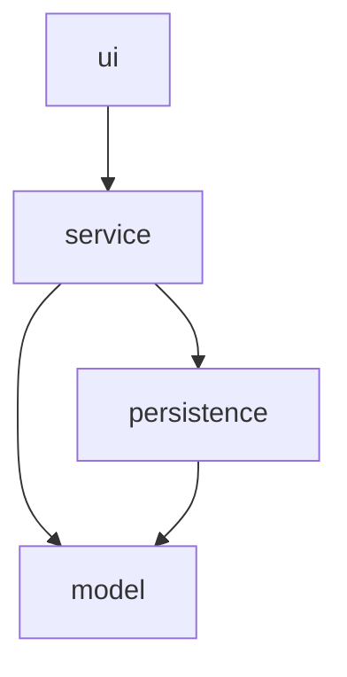

# Taller-GameZoneUnicesar-P3
A repository focused on Taller 2 based on the game store system GameZone Unicesar.
Facultad de Ingenierías y Tecnológicas, Universidad Popular del Cesar, SS462 Programación de Computadores III Grupo 02-CAMPUS

## About
GameZone Unicesar is a game store space located in Valledupar's Universidad Popular del Cesar University. This store is focused on selling gaming products to the Unicesar community, such as consoles, videogames, and other peripherals and gadgets like controllers, cables, memory.
The system is 100% built on Java with Maven, based on OOP (Object-Oriented Programming) and layered architecture theory, providing a consistent flow of data between the customers, store owners and employees. 

## Reference Implementation Notice
This repository was built and is maintained by two users; alvarodaramendiz and jahdieldtorres, as documented in [TEAM.md](TEAM.md), following a persistent dynamic of leadership and development through the entire project.

## Architecture
As mentioned before, the system is based on layered architecture theory, which is represented as a simple model of packages that function in a hierarchical dynamic.
A parent package **com.gamezone** is used to contain the entire package architecture. It contains the following: `model, persistence, service, ui` which, when related to the parent package, appear as `com.gamezone.model, com.gamezone.persistence, com.gamezone.service, com.gamezone.ui`

The layered architecture that GameZone contains is the following: `com.gamezone.ui -> com.gamezone.service -> com.gamezone.persistence -> com.gamezone.model`

## Requirements

- Java 17 or later
- Maven 3.8 or later
- GitHub CLI (`gh`) — only for reproducing the workflow used to build this repository

- ## Extended Modules

As the business grows, requirements are met to accomplish more customers. This considers an additive process of new modules into the system.
